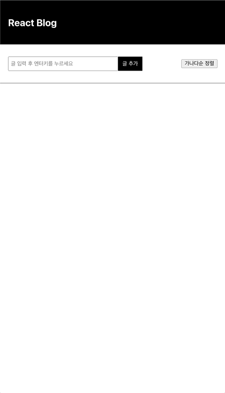

# 📅 React-Blog-Front

**React.js** 학습을 목적으로 제작하게 된 블로그의 프론트엔드 단입니다.  

## 📃 개요

- **React.js** 연습을 목적으로 간단하게 구현한 Blog입니다.
- 아이디어 및 디자인은 <a href="https://codingapple.com/">**코딩애플 강의**</a>를 참고하였습니다.

## URL
https://definitely92.github.io/blog/

## 💻 사용 기술

 

## 📜 간략한 설명

- 간단한 블로그의 프론트엔드 단입니다. 

## 🎬 시연 영상

